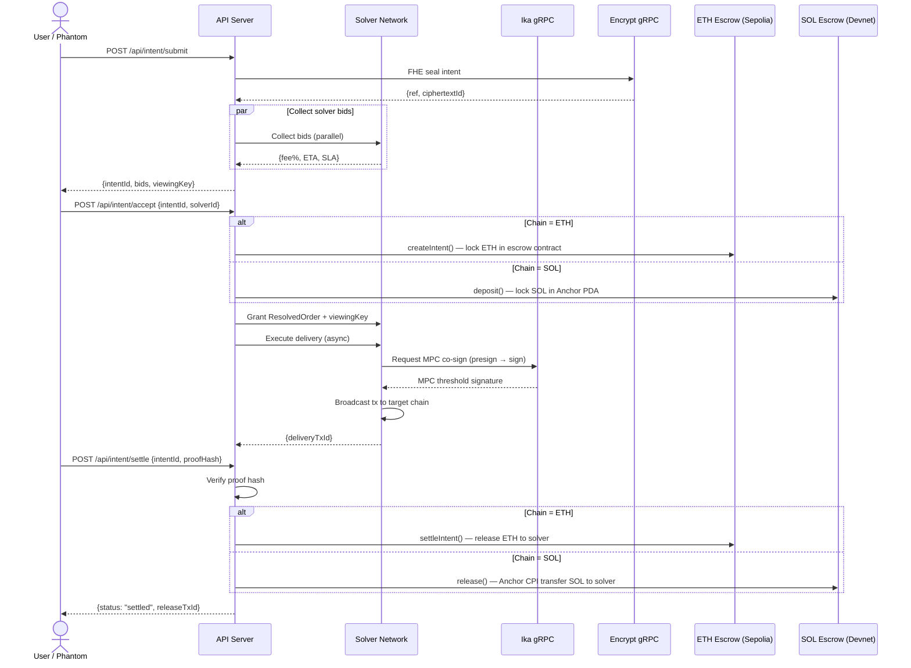
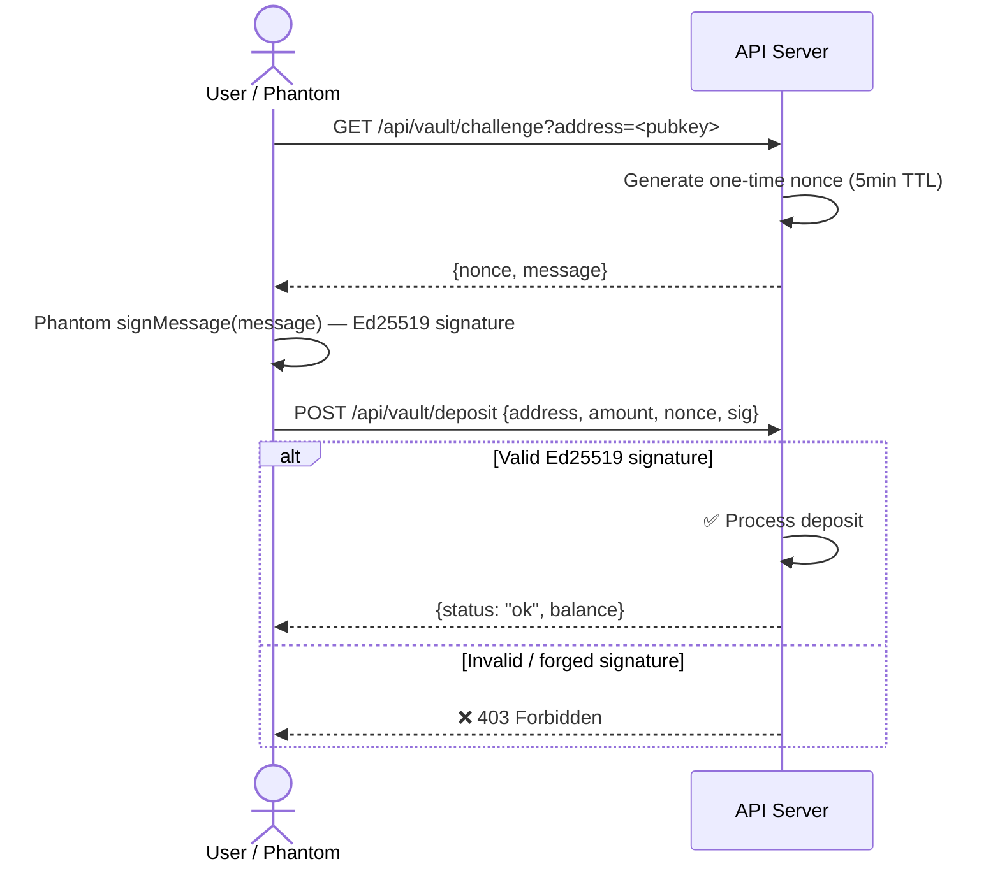
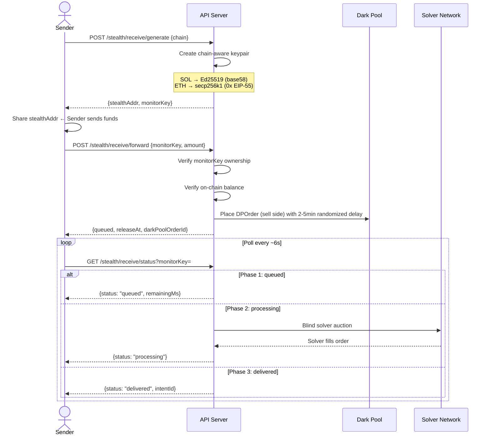
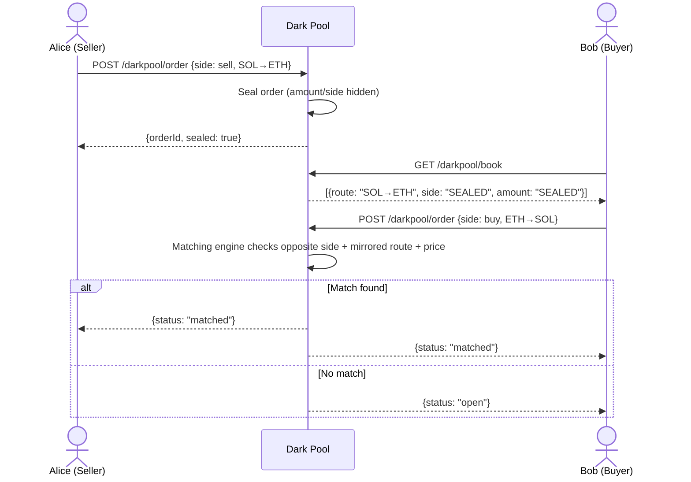
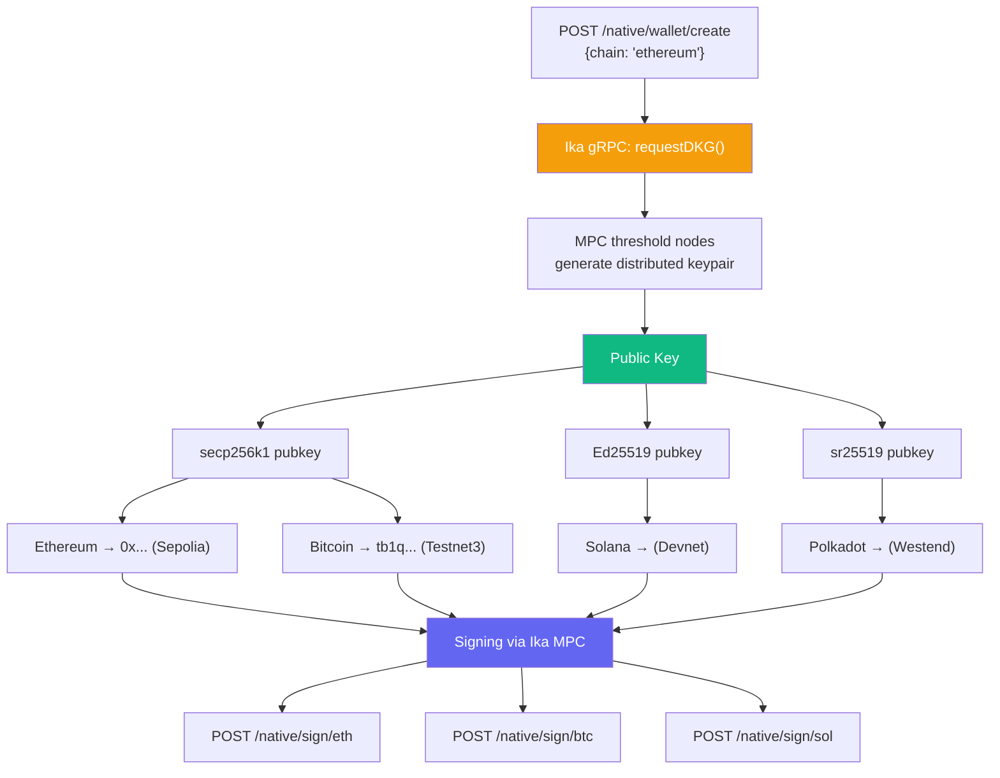

# Private Intent

**Privacy-first, bridgeless cross-chain intent engine**  
Powered by Ika MPC, Encrypt FHE, and on-chain escrow on Solana + Ethereum

> Colosseum Frontier Hackathon 2026 — Ika + Encrypt Track

---

## 📑 Daftar Isi

- [The Problem](#the-problem)
- [The Solution — Private Intent](#the-solution--private-intent)
- [🚀 Deployed Smart Contracts](#-deployed-smart-contracts)
  - [Ethereum Sepolia (Solidity)](#ethereum-sepolia---privateintentescrowsol)
  - [Solana Devnet (Anchor Native)](#solana-devnet---native-anchor-program-prism_dwallet_escrow)
  - [Escrow Flow Comparison](#escrow-flow-comparison)
- [Why Ika and Encrypt Are Not Decorative](#why-ika-and-encrypt-are-not-decorative)
- [Monorepo Structure](#monorepo-structure)
- [Database Tables](#database-tables)
- [Workflow Diagrams](#workflow-diagrams)
- [Features](#features)
- [🧠 Architecture](#-architecture)
- [🔧 Backend Services](#-backend-services)
- [External Networks](#external-networks)
- [Complete API Reference](#complete-api-reference)
- [Environment Variables](#environment-variables)
- [Build & Run Locally](#build--run-locally)
- [Escrow Contract Deployment](#escrow-contract-deployment)
- [Verifying On-Chain (for Judges)](#verifying-on-chain-for-judges)
- [Live Endpoints](#live-endpoints)
- [Tech Stack](#tech-stack)

---

## The Problem

Cross-chain DeFi today is broken in three fundamental ways:

**1. Your intent is public before execution.**  
Every swap, bridge, and transfer goes through a public mempool or RPC endpoint. MEV bots can see your token pair, amount, and direction before the transaction lands. On-chain observers front-run, sandwich, and extract value from your trade before it settles.

**2. Bridges are single points of failure.**  
Bridging from Solana to Ethereum (or any EVM chain) means trusting a centralized relayer or a multi-sig committee with your funds mid-flight. In 2022–2023, bridge hacks accounted for over $2B in losses. "Bridgeless" is not a buzzword — it's a security requirement.

**3. Solver auctions are not blind.**  
Existing intent protocols (CoW, Anoma, UniswapX) reveal the full order — wallet, amount, token pair — to all competing solvers before fill. A solver with privileged information can game the auction or front-run the winner.

**Target users:** DeFi-native Solana users who want cross-chain exposure without giving up privacy, key custody, or trade confidentiality.

---

## The Solution — Private Intent

Private Intent seals your swap intent with Fully Homomorphic Encryption (Encrypt FHE) *before* any solver ever sees it. The cross-chain order is filled via a blind solver auction where solvers bid on an encrypted hash — not the plaintext order. Execution is co-signed by Ika's MPC threshold network, so no private key ever exists on a single machine. Funds are secured by real on-chain escrow contracts on both **Ethereum Sepolia** and **Solana Devnet**.

```
User types intent
        │
        ▼
1. Claude AI (haiku-4-5) parses natural language
   → {fromToken: SOL, toToken: PYUSD, toChain: Sepolia, amount: 0.5}
        │
        ▼
2. Encrypt FHE seals intent BEFORE routing (MEV shield)
   → ciphertext committed on Encrypt devnet
   → CrossChainOrder built with encryptedOrderData (ERC-7683-inspired)
   → solvers see only token route + encrypted hash, never amounts/addresses
        │
        ▼
3. Blind solver auction
   → 4+ competing solvers submit bids (fee%, ETA, SLA)
   → User selects best bid
   → User receives one-time Viewing Key to verify solver's proposed fill
        │
        ▼
4. Escrow lock → ResolvedOrder granted
   → On-chain escrow locked on Solana Devnet (Anchor PDA) or ETH Sepolia (smart contract)
   → Solver granted ResolvedOrder with temporary decrypt access
        │
        ▼
5. Ika MPC threshold co-sign (BLOCKING — no bypass)
   → Ed25519 / Secp256k1 keypair derived via DKG
   → Transaction bytes sent to Ika gRPC (requestPresign → requestSign)
   → Private key never exists on any single machine
   → Signature injected → broadcast to Solana devnet or ETH Sepolia
        │
        ▼
6. Delivery proof → escrow release (REAL ON-CHAIN TX)
   → Solver posts proof of fill
   → ETH: settleIntent() called on PrivateIntentEscrow contract
   → SOL: release() called on Anchor native program via CPI → SOL → solver
   → Intent marked SETTLED
```

---

## 🚀 Deployed Smart Contracts

### Ethereum Sepolia — `PrivateIntentEscrow.sol`

| Item | Detail |
|------|--------|
| **Contract Address** | [`0x47D8A17167082B68Bf7f2004754BBC3A43b5Bd9A`](https://sepolia.etherscan.io/address/0x47D8A17167082B68Bf7f2004754BBC3A43b5Bd9A) |
| **Deploy TX** | `0x4561f5ce69b9b6b61b528bf0c297139c95d09f131dec15ba795aea9a7a4e6a2e` |
| **Block Number** | 10853886 |
| **Deployer / Sentinel** | `0xFe4957467b528e6E4F2712DCD3C2D4BaB2CDb6AA` |
| **Source** | `artifacts/escrow-contract/contracts/PrivateIntentEscrow.sol` |
| **Framework** | Hardhat + Solidity |
| **ABI** | `artifacts/escrow-contract/build/PrivateIntentEscrow.abi.json` |

**Functions:**
```
createIntent(fromChain, toChain, fromToken, toToken, releaseAfter, proofHash)  payable → intentId
deposit(intentId, deadline)                                                     payable → add ETH / update deadline
settleIntent(intentId, solverAddress, deliveryTxHash)                           → releases ETH to solver
refundIntent(intentId)                                                          → returns ETH to user
disputeIntent(intentId)                                                         → flags for arbitration
getIntent(intentId)                                                             → intent details
getIntentCount()                                                                → total intents
sentinel()                                                                      → sentinel address
```

### Solana Devnet — Native Anchor Program (prism_dwallet_escrow)

| Item | Detail |
|------|--------|
| **Program ID** | `GJbT5jcR38MzkmsCDrVWrjq2Bvg961CUkMnvUq7naqmq` |
| **Deployer / Operator** | Hardcoded keypair (see `solanaEscrowService.ts`) |
| **Network** | Solana Devnet |
| **Language** | Rust (native Solana program, Anchor-compatible wire format) |
| **Source** | `artifacts/sol-escrow/programs/private_intent_escrow/src/lib.rs` |
| **Framework** | Anchor 0.30.1 (native, no Anchor SDK) |
| **PDA Seeds** | `["escrow", intent_id.to_le_bytes()]` |

**Instructions (Anchor discriminators):**
```
deposit(intent_id: u64, deadline: i64, amount: u64)     → 0xf223c68952e1f2b6
release(intent_id: u64, solver: Pubkey)                  → 0xfdf90fce1c7fc1f1
refund(intent_id: u64)                                    → 0x0260b7fb3fd02e2e
```

**Account layout (98 bytes):**
```
8 bytes  → Anchor discriminator for EscrowAccount
8 bytes  → intent_id (u64)
32 bytes → depositor (Pubkey)
32 bytes → solver (Pubkey, default all zeros)
8 bytes  → amount (u64)
8 bytes  → deadline (i64)
1 byte   → released (bool)
1 byte   → bump
```

### Escrow Flow Comparison

| Step | Solana Devnet (Anchor Native) | Ethereum Sepolia (Solidity) |
|------|-------------------------------|------------------------------|
| **Lock** | User calls `deposit()` → SOL locked in PDA escrow account | User calls `createIntent()` (payable) → ETH in contract |
| **Settlement** | `release()` called by operator → SOL transferred to solver PDA | `settleIntent()` called by sentinel signer → ETH released |
| **Refund** | `refund()` called by depositor after deadline → SOL returned | `refundIntent()` called by sentinel → ETH returned |
| **Dispute** | (Future: add dispute instruction) | `disputeIntent()` flags on-chain |

---

## Why Ika and Encrypt Are Not Decorative

**Remove Ika:** `POST /api/intent/execute` returns 400 before any transaction is built. No signing path exists. The stealth address keypairs (Ed25519 for SOL, secp256k1 for ETH) cannot be generated. The native multi-chain wallet (ETH Sepolia, BTC testnet3, SOL devnet) does not exist. **The product does not function.**

**Remove Encrypt:** Swap intents are submitted to solvers in plaintext. MEV bots observe the token pair and amount from API traffic before routing completes. The blind auction is no longer blind. The MEV-resistance claim is false.

Both are essential. Neither is decorative.

---

## Monorepo Structure

```
artifacts/
  api-server/              Express 5 backend (port 8080)
  prism-dwallet-web/       React 19 + Vite 7 web dashboard (port 5173)
  escrow-contract/         🔷 Ethereum Sepolia — PrivateIntentEscrow.sol (Solidity)
  sol-escrow/              🔷 Solana Devnet — private_intent_escrow (Rust native Anchor)
  mockup-sandbox/          Mockup sandbox environment
  pitch-deck/              Hackathon pitch deck
lib/
  db/                      Drizzle ORM schema + PostgreSQL migrations
  api-zod/                 Shared Zod validation schemas
  api-spec/                OpenAPI spec
  integrations/            General integrations
  integrations-anthropic-ai/  Anthropic Claude integration wrapper
scripts/                   Migration helpers
```

## Database Tables

| Table | Purpose |
|---|---|
| `intents` | CrossChainOrder lifecycle — status, bids, escrow, proof |
| `dwallet_profiles` | Ika DKG outputs — dwalletId, pubkey, viewingKeyHash |
| `native_wallets` | Multi-chain wallets — pubkeyHex, eth/btc/sol addresses |
| `vault_balances` | Shielded vault — address → shielded balance |
| `vault_history` | Vault operation log — deposits, withdrawals |

---

## Workflow Diagrams

Interactive diagrams using [Mermaid](https://mermaid.js.org/) — render natively on GitHub and support interactive zoom/pan.

---

### 1. Private Intent — Full Lifecycle

A cross-chain swap intent flowing from submission to on-chain escrow settlement:



---

### 2. Shielded Vault — Ed25519 Challenge-Response

Only the Phantom wallet owner can deposit or withdraw:



---

### 3. Private Drop (Stealth Receive) — Mixing Layer

Stealth addresses with dark pool mixing for privacy:



---

### 4. Dark Pool — Blind P2P Order Matching

Orders are sealed — only the token route is visible for matching:



---

### 5. Native Multi-Chain Wallet (Ika DKG)

One DKG session derives addresses for all chains simultaneously:



---

### 6. Blind Solver Auction — Privacy Flow

FHE encryption ensures solvers bid without seeing the underlying intent:


---

## Features

### 1. Private Intent Engine (ERC-7683-Inspired)

The core engine implements the full CrossChainOrder lifecycle with **real on-chain escrow**:

| Step | Endpoint | Description |
|---|---|---|
| Submit | `POST /api/intent/submit` | FHE-seal intent → build CrossChainOrder → collect solver bids |
| Status | `GET /api/intent/:id` | Live status, bids, escrow state, delivery tracking |
| Accept | `POST /api/intent/accept` | User picks solver → **lock escrow on-chain** → grant ResolvedOrder |
| Settle | `POST /api/intent/settle` | Solver posts proof → verify → **release escrow (REAL on-chain tx)** |
| History | `GET /api/intent/history` | Privacy-preserved network activity |
| Solvers | `GET /api/intent/solvers` | All available solvers and capabilities |
| Config | `GET /api/escrow/config` | Escrow sentinel pubkey + RPC |

**Privacy model:**
- Intent committed to Encrypt FHE devnet before any solver bid is requested
- Solvers receive only: route (tokenIn → tokenOut), fill deadline, encrypted hash
- Amounts and wallet addresses sealed in `encryptedOrderData`
- Winner gets a one-time Viewing Key to validate intent before execution
- Even the server cannot reverse the cipher without the user's viewing key

**On-chain escrow settlement:**
- **ETH Sepolia:** `settleIntent()` called on `PrivateIntentEscrow` contract at `0x47D8A17167082B68Bf7f2004754BBC3A43b5Bd9A`
- **Solana Devnet:** `release()` Anchor instruction called via CPI → SOL transferred from PDA to solver

---

### 2. Solver Network

Four built-in solver profiles compete on every intent:

| Solver | Strategy | Focus |
|---|---|---|
| Aggressive Solver | `aggressive` | Lowest fee percentage |
| Instant Solver | `instant` | Fastest estimated delivery |
| Premium Solver | `premium` | Guaranteed SLA (slower, higher fee) |
| PYUSD Bridge Solver | `pyusd` | Specialist for PayPal USD cross-chain fills |

Plus two dynamic solvers:
- **AI Solver** — Claude-powered autonomous bidding agent that optimizes fee/speed based on current market rates
- **Live Solver** — the server's own funded keypair (SOL devnet + ETH Sepolia) that can execute real on-chain deliveries

Custom solvers can register via the registry (`services/customSolverRegistry.ts`) with their own keypairs and fee profiles.

---

### 3. Shielded Vault

A non-custodial balance layer with Ed25519 challenge-response authentication. Only the Phantom wallet owner can deposit or withdraw — every mutating operation requires a valid Ed25519 signature over a server-issued one-time nonce.

**Workflow:**
```
1. GET  /api/vault/challenge?address=<phantomPubkey>
   → {nonce, message}  (one-time, 5-minute TTL)

2. Client signs `message` with Phantom's signMessage()
   → signature (64-byte Ed25519, hex-encoded)

3. POST /api/vault/deposit   {address, amount, nonce, signature}
   or
   POST /api/vault/withdraw  {address, amount, toStealthAddress, nonce, signature}
   → Server verifies Ed25519 sig(message) against address pubkey
   → Mutation only proceeds if valid
```

Routes:

| Method | Endpoint | Auth |
|---|---|---|
| `GET` | `/api/vault/challenge` | None |
| `GET` | `/api/vault/balance` | None (read-only) |
| `POST` | `/api/vault/deposit` | Ed25519 sig required |
| `POST` | `/api/vault/withdraw` | Ed25519 sig required |
| `GET` | `/api/vault/history` | None (read-only) |

---

### 4. Private Drop (Stealth Receive)

Generate a one-time, chain-aware stealth address to receive funds privately. The address is cryptographically bound to a `monitorKey` stored server-side — only the owner can authorize a forward.

When funds are forwarded, they enter the **Dark Pool mixing layer** with a randomized 2–5 minute delay before delivery. This prevents timing analysis from linking the stealth deposit to the destination wallet.

**Two key types:**
- **SOL Devnet** → Ed25519 keypair → base58 address (Solana-native)
- **ETH Sepolia** → secp256k1 keypair → EIP-55 checksum `0x` address

**3-phase workflow:**
```
1. POST /api/stealth/receive/generate  {phantomPubkey, chain: "SOL" | "ETH"}
   → {stealthAddress, monitorKey, network, keySource}

2. Share stealthAddress with sender (copy to clipboard in UI)

3. GET  /api/stealth/receive/balance/:address
   → Auto-detects chain from address format
   → 0x prefix  → polls Sepolia RPC (eth_getBalance)
   → base58     → polls Solana devnet (getBalance)
   → {balance, chain, network, hasIncoming}

4. POST /api/stealth/receive/forward  {stealthAddress, ownerPhantomPubkey, monitorKey, amount}
   → Verifies monitorKey ownership (403 if invalid)
   → Verifies on-chain balance ≥ requested amount (422 if insufficient)
   → Places a sealed DPOrder (sell side) into the shared Dark Pool orderBook
   → Randomised 2–5 min delay before solver auction (mixing / timing privacy)
   → Returns {status: "queued_in_dark_pool", releaseAt, darkPoolOrderId}

5. GET  /api/stealth/receive/status/:address?monitorKey=<key>  (poll every ~6s)
   → monitorKey validated BEFORE entry lookup — third parties learn nothing
   → Phase 1 "queued"     → still in dark pool, returns remainingMs
   → Phase 2 "processing" → delay expired, blind solver auction in progress
   → Phase 3 "delivered"  → funds forwarded, solver settled, intentId returned
```

---

### 5. Dark Pool — Blind P2P Order Matching

A permissionless P2P matching engine where orders are sealed before matching. Counterparty wallet, amount, and side are never visible to the other party — only the token route (tokenIn → tokenOut) is revealed for matching purposes.

| Method | Endpoint | Description |
|---|---|---|
| `POST` | `/api/darkpool/order` | Place a sealed buy/sell order |
| `GET` | `/api/darkpool/book` | Anonymized open order book (no wallet/amount/side) |
| `GET` | `/api/darkpool/myorders` | Caller's own orders with full detail |
| `DELETE` | `/api/darkpool/order/:id` | Cancel an open order |

---

### 6. Native Multi-Chain Wallet (Ika DKG)

Create a multi-chain wallet via Ika Distributed Key Generation. One DKG session derives addresses for all four supported curves simultaneously — no seed phrase, no single point of key custody.

| Chain | Curve | Network |
|---|---|---|
| Ethereum | secp256k1 | Sepolia testnet |
| Bitcoin | secp256k1 | Testnet3 |
| Solana | Ed25519 | Devnet |
| Polkadot | sr25519 | Westend testnet |

Routes:

| Method | Endpoint | Description |
|---|---|---|
| `POST` | `/native/wallet/create` | DKG via Ika → derive addresses for all chains |
| `POST` | `/native/sign/eth` | Sign + broadcast Ethereum tx on Sepolia |
| `POST` | `/native/sign/btc` | Sign + broadcast Bitcoin tx on Testnet3 |
| `POST` | `/native/sign/sol` | Sign + broadcast Solana tx on Devnet |
| `GET` | `/native/wallet/:id` | Get wallet + all derived addresses |

---

### 7. AI-Powered Features

All AI features use Claude (haiku-4-5) via the Anthropic integration:

- **Natural language intent parsing** — type "swap 0.5 SOL to PYUSD on Sepolia" and Claude extracts structured intent fields
- **AI Solver Agent** — autonomous solver that bids using current live rates, optimizing for fee or speed based on market conditions
- **Dispute Resolution** — Claude acts as neutral judge for contested fills; reviews intent hash, solver proof, and on-chain evidence
- **Route Optimization** — AI recommends optimal solver strategy based on amount, urgency, and current fees

Routes:

| Method | Endpoint | Description |
|---|---|---|
| `POST` | `/api/intent/parse` | NL → structured intent |
| `POST` | `/api/ai/solve` | AI solver bid for given intent |
| `POST` | `/api/ai/dispute` | AI dispute judge |

---

### 8. Live Rates

Real-time spot prices from CoinGecko with 60-second cache.

```bash
GET /api/rates
→ {
    prices: { SOL: 93.42, ETH: 2332.44, PYUSD: 1.00 },
    rates: { SOL_ETH: 0.04005, ETH_SOL: 24.97, ... },
    source: "coingecko",
    cacheTtlSeconds: 60
  }
```

---

### 9. Integration Health Check

Live status of all external network connections:

```bash
GET /api/healthz/integrations
```

Returns status for: Ika gRPC (latency probe), Encrypt gRPC, Anthropic Claude, Solana devnet, Bitcoin testnet3, and ETH Sepolia escrow.

---

## 🧠 Architecture

```
┌──────────────────────────────────────────────────────────────────────────┐
│                         PrivateIntent                                    │
│         Privacy-first Cross-Chain Intent Settlement Layer                 │
├──────────────────────────────────────────────────────────────────────────┤
│                                                                          │
│  ┌──────────┐    ┌───────────┐    ┌──────────────┐    ┌──────────────┐  │
│  │  User     │    │  Encrypt  │    │  Ika MPC     │    │  Solver      │  │
│  │ (Phantom) │───▶│  FHE      │───▶│  Network     │───▶│  Network     │  │
│  │  Wallet   │    │  Seal     │    │  Co-sign     │    │  (AI + MM)   │  │
│  └──────────┘    └───────────┘    └──────────────┘    └──────────────┘  │
│       │                                                      ▲           │
│       │  ① Submit intent (FHE-sealed)                        │           │
│       │  ② Solvers bid blind                                 │           │
│       │  ③ User accepts → ESCROW LOCKED                      │ ⑤ Proof   │
│       ▼                                                      │           │
│  ┌───────────────────────────────────────────────────────────┘           │
│  │                                                                       │
│  │  ┌─────────────────────────────┐    ┌──────────────────────────┐     │
│  │  │  ETH Sepolia                │    │  Solana Devnet            │     │
│  │  │  PrivateIntentEscrow.sol    │    │  private_intent_escrow    │     │
│  │  │  0x47D8A17167...43b5Bd9A    │    │  GJbT5jcR38...aqmq       │     │
│  │  │  Solidity (Hardhat)         │    │  Rust (Anchor native)    │     │
│  │  │                             │    │                           │     │
│  │  │  createIntent()  payable    │    │  deposit() → PDA lock    │     │
│  │  │  settleIntent()  release    │    │  release() → CPI tx      │     │
│  │  │  refundIntent()  return     │    │  refund() → depositor    │     │
│  │  │  disputeIntent() flag       │    │                           │     │
│  │  └─────────────────────────────┘    └──────────────────────────┘     │
│  │                                                                       │
│  └─────────────────────── ON-CHAIN ESCROW ────────────────────────────┘ │
│                                                                          │
│  ④ Solver delivers on destination chain via Ika MPC                     │
│  ⑤ Settlement: proof verified → escrow released via REAL on-chain tx    │
│                                                                          │
└──────────────────────────────────────────────────────────────────────────┘
```

## 🔧 Backend Services

| Service | File | Description |
|---------|------|-------------|
| ETH Escrow | `ethEscrowService.ts` | Sepolia `PrivateIntentEscrow.sol` integration |
| Solana Escrow | `solanaEscrowService.ts` | Devnet Anchor native program via CPI |
| Solana Broadcast | `solanaBroadcast.ts` | Memo tx broadcast to Solana devnet |
| Ika MPC | `ika.ts`, `ikaMultichain.ts` | Multi-chain MPC signing |
| Encrypt FHE | `encrypt.ts` | Fully Homomorphic Encryption |
| AI Solver | `aiSolverAgent.ts` | Claude-powered autonomous solver |
| Solver Engine | `solverEngine.ts` | Static route/price solver |
| Dark Pool MM | `botMarketMaker.ts` | Market maker bot |
| Live Rates | `liveRates.ts` | CoinGecko price feed |
| Native Signer | `nativeSigner.ts` | BTC/ETH/SOL native tx signing |

## External Networks

| Network | Endpoint | Used For |
|---|---|---|
| **Ika devnet** | `pre-alpha-dev-1.ika.ika-network.net:443` | MPC DKG + co-sign |
| **Encrypt devnet** | `pre-alpha-dev-1.encrypt.ika-network.net:443` | FHE intent seal |
| **Solana devnet** | `https://api.devnet.solana.com` | Escrow PDA, CPI, SOL balance |
| **ETH Sepolia** | `https://ethereum-sepolia-rpc.publicnode.com` | ETH balance + broadcast + escrow contract |
| **CoinGecko** | `https://api.coingecko.com` | Live SOL/ETH/PYUSD prices |

> **Why all testnet/devnet?** Ika and Encrypt are pre-alpha (devnet only). Keeping every leg on pre-production networks means Ika = real MPC custody, Encrypt = real FHE seal, escrow = real on-chain contracts. When Ika/Encrypt launch mainnet, one config change makes this day-one mainnet.

---

## Complete API Reference

### Intent Engine

| Method | Endpoint | Body / Query | Description |
|---|---|---|---|
| `POST` | `/api/intent/submit` | `{phantomPubkey, fromToken, toToken, fromChain, toChain, amount}` | FHE-seal → CrossChainOrder → solver bids |
| `GET` | `/api/intent/:id` | — | Live intent status + bids + escrow + delivery |
| `POST` | `/api/intent/accept` | `{intentId, solverId}` | Lock escrow on-chain, grant ResolvedOrder |
| `POST` | `/api/intent/settle` | `{intentId, proofHash}` | Verify proof → release escrow (REAL tx) |
| `GET` | `/api/intent/history` | — | Privacy-preserved network activity |
| `GET` | `/api/intent/solvers` | — | All available solvers |
| `POST` | `/api/intent/parse` | `{text}` | Claude NL → structured intent |
| `GET` | `/api/escrow/config` | — | Sentinel pubkey + RPC for escrow funding |

### Private Drop (Stealth Receive)

| Method | Endpoint | Body / Params | Description |
|---|---|---|---|
| `POST` | `/api/stealth/receive/generate` | `{phantomPubkey, chain}` | Generate chain-aware stealth address |
| `GET` | `/api/stealth/receive/balance/:address` | `:address` | Poll balance (chain auto-detected) |
| `POST` | `/api/stealth/receive/forward` | `{stealthAddress, ownerPhantomPubkey, monitorKey, amount}` | Queue into dark pool with 2–5 min mixing delay |
| `GET` | `/api/stealth/receive/status/:address` | `?monitorKey=` | Poll delivery phase |

### Shielded Vault

| Method | Endpoint | Body / Query | Description |
|---|---|---|---|
| `GET` | `/api/vault/challenge` | `?address=` | Issue one-time nonce to sign |
| `GET` | `/api/vault/balance` | `?address=` | Shielded balance |
| `POST` | `/api/vault/deposit` | `{address, amount, nonce, signature}` | Shield assets (Ed25519 auth) |
| `POST` | `/api/vault/withdraw` | `{address, amount, toStealthAddress, nonce, signature}` | Unshield to stealth address (Ed25519 auth) |
| `GET` | `/api/vault/history` | `?address=` | Recent vault operations |

### Dark Pool

| Method | Endpoint | Body / Params | Description |
|---|---|---|---|
| `POST` | `/api/darkpool/order` | `{phantomPubkey, side, tokenIn, tokenOut, amount, priceLimit?}` | Place sealed order |
| `GET` | `/api/darkpool/book` | — | Anonymized open book |
| `GET` | `/api/darkpool/myorders` | `?phantomPubkey=` | Caller's own orders |
| `DELETE` | `/api/darkpool/order/:id` | — | Cancel order |

### Native Multi-Chain Wallet

| Method | Endpoint | Body | Description |
|---|---|---|---|
| `POST` | `/native/wallet/create` | `{chain: "ethereum"\|"bitcoin"\|"solana"\|"polkadot"}` | Ika DKG → multi-chain addresses |
| `GET` | `/native/wallet/:id` | — | Get wallet + all addresses |
| `POST` | `/native/sign/eth` | `{walletId, to, value, data?}` | Sign + broadcast ETH tx (Sepolia) |
| `POST` | `/native/sign/btc` | `{walletId, to, satoshis}` | Sign + broadcast BTC tx (Testnet3) |
| `POST` | `/native/sign/sol` | `{walletId, to, lamports}` | Sign + broadcast SOL tx (Devnet) |

### AI & Rates

| Method | Endpoint | Description |
|---|---|---|
| `GET` | `/api/rates` | Live SOL/ETH/PYUSD prices (CoinGecko, 60s cache) |
| `POST` | `/api/ai/solve` | AI solver bid for given intent |
| `POST` | `/api/ai/dispute` | Claude judges a contested fill |

### System

| Method | Endpoint | Description |
|---|---|---|
| `GET` | `/api/healthz` | Simple liveness check |
| `GET` | `/api/healthz/integrations` | Live status of all external networks |

---

## Environment Variables

Copy `.env.example` → `.env` and configure:

| Variable | Required | Description |
|----------|----------|-------------|
| `DATABASE_URL` | ✅ | PostgreSQL connection string |
| `PORT` | ✅ | API server port (default: 8080) |
| `AI_INTEGRATIONS_ANTHROPIC_BASE_URL` | ✅ | `https://api.anthropic.com` |
| `AI_INTEGRATIONS_ANTHROPIC_API_KEY` | ✅ | Claude API key |
| `ESCROW_CONTRACT_ADDRESS` | ✅ | ETH escrow contract on Sepolia |
| `ETH_ESCROW_CONTRACT_ADDRESS` | ✅ | Alias for above |
| `SOLANA_ESCROW_PROGRAM_ID` | ✅ | Solana Anchor native program ID |
| `ETHEREUM_RPC_URL` | ✅ | Sepolia RPC endpoint |
| `ETH_SOLVER_PRIVATE_KEY` | ⬜ | Solver ETH wallet PK (for real testnet delivery) |
| `SOLANA_SECRET_KEY_ARRAY` | ⬜ | Persist sentinel keypair across restarts |
| `SOLANA_DEVNET_PUBKEY` | ⬜ | Sentinel public key (base58) |
| `MASTER_ENCRYPT_KEY` | ⬜ | FHE master key (64 hex chars) |

**Current deployed values:**
```
ETH_ESCROW_CONTRACT_ADDRESS=0x47D8A17167082B68Bf7f2004754BBC3A43b5Bd9A
SOLANA_ESCROW_PROGRAM_ID=GJbT5jcR38MzkmsCDrVWrjq2Bvg961CUkMnvUq7naqmq
SENTINEL_ETH_ADDRESS=0xFe4957467b528e6E4F2712DCD3C2D4BaB2CDb6AA
```

**What needs no API keys:**
- Ika devnet — public gRPC endpoint, no registration
- Encrypt devnet — public gRPC endpoint, no registration
- Solana devnet — public RPC (`https://api.devnet.solana.com`)
- ETH Sepolia — public RPC (`https://ethereum-sepolia-rpc.publicnode.com`)

---

## Build & Run Locally

### Prerequisites

| Requirement | Version |
|---|---|
| Node.js | 20+ |
| pnpm | 9+ |
| PostgreSQL | 17 (installed at `C:\Program Files\PostgreSQL\17`, running on port 5432) |
| Git | 2+ |

### Quick Start

```bash
# 1. Install dependencies
pnpm install

# 2. Copy and configure .env
cp .env.example .env
# → Edit .env with your values (see Environment Variables section above)
# → Minimal required: set DATABASE_URL (even if PG isn't running — server starts anyway)

# 3. Build API server (esbuild)
pnpm --filter @workspace/api-server exec -- node build.mjs
# Output: dist/index.mjs (5.4mb), dist/seed.mjs (2.2mb), ...

# 4. Start API server (port 8080)
pnpm --filter @workspace/api-server exec -- node --enable-source-maps dist/index.mjs
# Server listening on port 8080
# LiveSolver auto-registered, Dark Pool seeded with 8 bot orders

# 5. (Separate terminal) Start web dashboard (port 5173)
pnpm --filter @workspace/prism-dwallet-web exec -- vite --config vite.config.ts --host 0.0.0.0
# → http://localhost:5173
```

### Verify

```bash
curl http://localhost:8080/api/healthz
# → {"status":"ok"}

curl http://localhost:8080/api/healthz/integrations
# → ika, encrypt, solana, ethereum, coingecko statuses

curl http://localhost:8080/api/rates
# → {prices: {SOL: ..., ETH: ..., PYUSD: 1.00}, ...}
```

### ⚠️ Known Issues

- **Typecheck (`pnpm run build`)**: Full monorepo typecheck fails due to a pre-existing TS error in `@ika.xyz/pre-alpha-solana-client`. Individual projects pass: `pnpm --filter @workspace/api-server run typecheck` passes.
- **Port 5433 conflict**: This project expects PostgreSQL on port 5433 by default, but the local install uses port 5432. Update `.env` accordingly (already done).

---

## Escrow Contract Deployment

### ETH Sepolia (Solidity)

```bash
# 1. Compile
node artifacts/escrow-contract/scripts/compile.js
# → Output: artifacts/escrow-contract/build/PrivateIntentEscrow.{abi.json,bin,json}

# 2. Set env vars in root .env
# DEPLOYER_PRIVATE_KEY=0x14f5247a148cfe65917e24248b61c3b6fe907ea6f8fa383b511dc2fd095b12ef
# SENTINEL_ETH_ADDRESS=0xFe4957467b528e6E4F2712DCD3C2D4BaB2CDb6AA

# 3. Deploy
node artifacts/escrow-contract/scripts/deploy-simple.js
```

**Current contract:** `0x47D8A17167082B68Bf7f2004754BBC3A43b5Bd9A`  
[View on Sepolia Etherscan](https://sepolia.etherscan.io/address/0x47D8A17167082B68Bf7f2004754BBC3A43b5Bd9A)

### Solana Devnet (Rust Anchor Native)

```bash
cd artifacts/sol-escrow

# Build the program
anchor build

# Deploy to devnet
anchor deploy --provider.cluster devnet

# Program ID: GJbT5jcR38MzkmsCDrVWrjq2Bvg961CUkMnvUq7naqmq
# Already deployed and verified on-chain
```

**Source:** `artifacts/sol-escrow/programs/private_intent_escrow/src/lib.rs`

**Instructions:**
| Discriminator | Instruction | Args |
|---|---|---|
| `0xf223c68952e1f2b6` | `deposit` | `(intent_id: u64, deadline: i64, amount: u64)` |
| `0xfdf90fce1c7fc1f1` | `release` | `(intent_id: u64, solver: Pubkey)` |
| `0x0260b7fb3fd02e2e` | `refund` | `(intent_id: u64)` |

**PDA:** `["escrow", intent_id.to_le_bytes()]` — 98 bytes account space

---

## Verifying On-Chain (for Judges)

| Claim | How to verify |
|---|---|
| **ETH escrow contract is real** | View on [Sepolia Etherscan](https://sepolia.etherscan.io/address/0x47D8A17167082B68Bf7f2004754BBC3A43b5Bd9A) — verified bytecode, deploy tx `0x4561f5ce...`, sentinel `0xFe495746...` |
| **Solana Anchor program is real** | `solana program show GJbT5jcR38MzkmsCDrVWrjq2Bvg961CUkMnvUq7naqmq --url devnet` → shows executable data, authority, slot |
| **Ika MPC DKG is real** | `POST /native/wallet/create` → inspect `mode: "devnet"` + `attestationHex` in response |
| **Encrypt FHE seal is real** | `POST /api/intent/submit` → `crossChainOrder.encryptedOrderData` is an on-chain ciphertext commitment |
| **Blind auction is blind** | `GET /api/intent/solvers` — `inputAmount` reads `"SEALED (Encrypt FHE — MEV shield)"` |
| **Ed25519 auth on vault** | `POST /api/vault/deposit` with forged signature → HTTP 403 |
| **Chain-aware stealth keys** | `chain: "ETH"` → `0x...` EIP-55 address. `chain: "SOL"` → base58 Ed25519 address |
| **Ika gRPC liveness** | `GET /api/healthz/integrations` → `ika.grpcReachable: true` |
| **Solana escrow settlement** | `POST /api/intent/settle` → `releaseTxExplorer` links to verifiable Solana Explorer tx |

---

## ✅ Live Ika MPC DKG — Real-time Verification

On **May 16, 2026**, the Ika MPC DKG was successfully executed live via `POST /api/dwallet/create`:

```
# Backend log output:
[IkaMultichain] DKG OK curve=curve25519 attempt=1/3 pubkey=1cdb6ee144330da2…
[IkaMultichain] DKG OK curve=secp256k1 attempt=1/3 pubkey=03e89815d728a658…
[dWallet] Created — ETH=0xc73fD0cC… BTC=tb1qd6zyu9dq… SOL=2weV2qfArb4w…
```

### Result:
```json
{
  "mode": "devnet",                     // ← Real MPC, NOT simulation!
  "dwallets": {
    "secp256k1": {
      "mode": "devnet",
      "ikaNetwork": "pre-alpha-dev-1.ika.ika-network.net:443",
      "sigSchemes": ["EcdsaKeccak256 → Ethereum", "EcdsaDoubleSha256 → Bitcoin"]
    },
    "curve25519": {
      "mode": "devnet",
      "sigSchemes": ["EddsaSha512 → Solana"]
    }
  },
  "addresses": {
    "eth": "0xc73fD0cC60B6dE90F30fD6AE7080110D4b82dE48",
    "btc": "tb1qd6zyu9dqc754wpydpkc5n4vjwq28fgeutkqafc",
    "sol": "2weV2qfArb4wLXdWyykW6DfYfrtRGXq3F7MjbFmTBTdT"
  },
  "bridgeless": true
}
```

One DKG session → **three blockchain addresses** (ETH + BTC + SOL) simultaneously, using real Ika MPC threshold nodes. No bridge, no seed phrase, no single point of failure.

---

## Live Endpoints

| Resource | URL |
|---|---|
| API | `http://localhost:8080` |
| Web dashboard | `http://localhost:5173` |
| Integration health | `http://localhost:8080/api/healthz/integrations` |
| Live rates | `http://localhost:8080/api/rates` |

---

## Tech Stack

- **Runtime:** Node.js 20+
- **Package Manager:** pnpm (workspaces)
- **Language:** TypeScript, Rust (Solana program), Solidity (ETH contract)
- **Backend Framework:** Express 5
- **Frontend Framework:** React 19 + Vite 7
- **Database:** PostgreSQL + Drizzle ORM
- **Blockchain (ETH):** Ethereum Sepolia + Hardhat + ethers.js
- **Blockchain (SOL):** Solana Devnet + @solana/web3.js + Anchor 0.30.1
- **Solana Program:** Rust native (Anchor-compatible wire format)
- **MPC:** Ika Network (pre-alpha) — gRPC
- **Privacy:** Encrypt FHE (pre-alpha) — gRPC
- **AI:** Anthropic Claude (haiku-4-5)

---

*Built for the Colosseum Frontier Hackathon 2026 — Ika + Encrypt Track.*